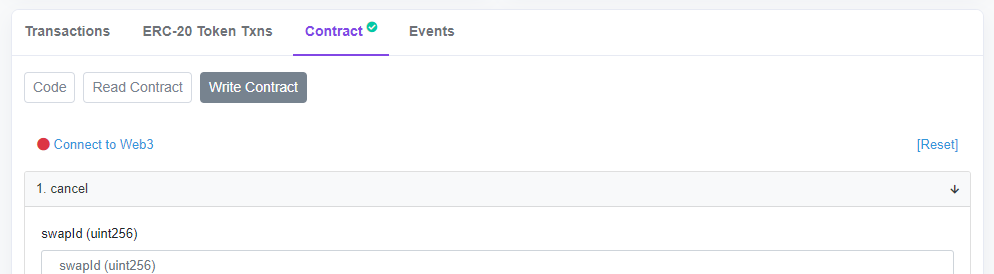
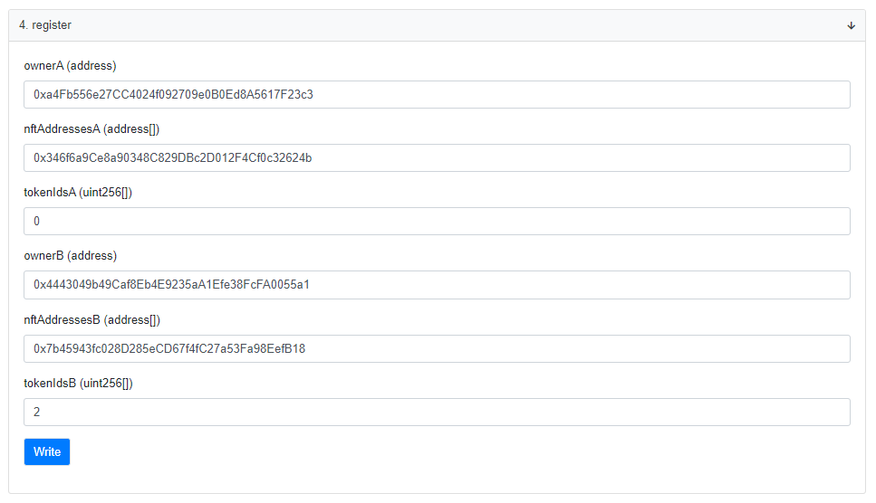
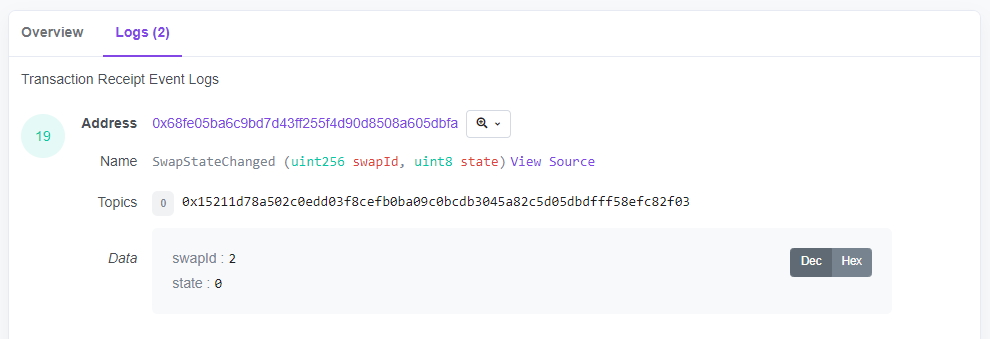

<h1 align="center"> NFT Swapper (WIP)</h1> 

Peer to peer exchange of multiple NFT

## 😎 Overview

Most NFT platforms allow you to sell and auction NFTs using cryptos, but they do not yet allow you to exchange them for other NFTs. When you want to exchange more than one, you currently need to trust even more with the other participant to fulfill the deal. These contracts solve this problem by acting as an trustless intermediary that escrows and exchanges the NFTs when both parties have deposited their part of the agreement. Official implementations have no owner or admin accounts so all activity is self sovereign.

ERC 721:

Polygon contract: [WIP]()

Mumbai contract: [0x68fE05bA6C9bd7d43FF255f4D90D8508a605dBfa](https://mumbai.polygonscan.com/address/0x68fE05bA6C9bd7d43FF255f4D90D8508a605dBfa#code)

## 📖 Usage
Although the procedure is simple (1. approve as an operator in the NFT contracts, 2. register a new swap, 3. deposit the NFTs by both parties and 4. claim to complete the exchange), it becomes a bit tedious due to the lack of a user-friendly front-end or GUI.

1. **Approve as operator**. Owners need to give this contract (addresses listed above) permissions to transfer their NFTs from the NFT contracts they want to swap. If the NFT contract is verified you can do it yourself from any method to give transfer permissions (like setApprovalForAll).

2. **Register a new swap**. You can register a new swap by sending a transaction to the contract. The contract will create a new swap with the given parameters.
  2. 1. Visit one of the above links according to the blockchain you want to use.
  2. 2. In Contract > Write Contract > Connect to Web3.
    
  2. 3. Go to `register` section to create a new on-chain swap agreement, in which the tokenIdsA of the nftAddressesA contracts owned by ownerA will be exchanged for the tokenIdsB of the nftAddressesB contracts owned by ownerB. Press `Write`, sign the transaction and wait for it to finish.

  2. 4. Get the `swapId` of the new swap agreement. You can use the `getSwaps` method located in Read Contract to get your last swapId by introducing your address. Another way is open the transaction in the Transaction tab and get it from the Logs.

3. **Deposit NFTs**. Both parties deposit NFTs (or one of them cancels the exchange).
4. **Claim swapped NFTs**. Both parties claim the NFTs.

## 🔎 Disclaimer

Use these contracts at your own risk. If you use these contracts you agree that you are legally responsible for any results. The contracts do not have admin mechanisms neither an owner, so only the participants of an exchange have the power to cancel, deposit and claim it. Be sure to use the official contract addresses listed in this document.

## ☕ Contribute  

Feel free to open an Issue or Pull Request! 

Let me know if you deploy the contract in other networks to list them here.

Give credit if you use these contracts in your project.
 
My address to thank me: daniga.eth or 0x4443049b49caf8eb4e9235aa1efe38fcfa0055a1.

We can talk about NFT development on my [Discord](https://discord.gg/QPMapnqAh7).

Follow me on Twitter [@DGANFT](https://twitter.com/DGANFT)!
